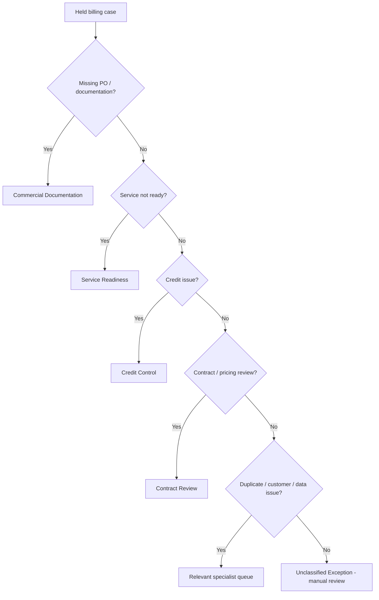

# Billing & Revenue Hold Management Platform

**Finance Transformation | Billing Controls | Revenue Operations | Decision Automation**

This project models a finance problem I find particularly useful to solve: orders can sit on billing hold for weeks or months, but the underlying reasons, ownership and financial exposure are often spread across spreadsheets, emails and different systems.

I recreated that problem using synthetic data and built a simple decision-support workflow around it.

## The problem

A billing team may know that an order is blocked, but still need to work out:

- why it is on hold;
- who should resolve it;
- how long it has been waiting;
- how much billing value is exposed;
- what should happen next; and
- which cases need escalation first.

That usually means repeated manual review, inconsistent ownership and poor visibility of the backlog.

## What I built

The prototype takes held-order data and turns it into an operational action queue. It validates the input, groups each hold into a standard category, assigns an owner, calculates age and value, applies a priority and recommends the next step.

The logic is intentionally explainable. If a case cannot be classified confidently, it goes to manual review rather than forcing a decision.

The tool does **not** release billing holds, recognise revenue or make accounting decisions automatically.

## Sample results

The synthetic dataset contains **12 held orders with £423.3k of illustrative billing value**.

| Priority | Cases | What it means |
|---|---:|---|
| Critical | 4 | Very aged and/or high-value cases needing immediate review |
| High | 6 | Material ageing or value requiring prioritised action |
| Medium | 1 | Standard managed exception |
| Low | 1 | Lower-risk case within normal review tolerance |

The sample covers missing purchase orders, service readiness, credit review, contract questions, duplicates, customer dependencies, data-quality issues and unclassified exceptions.

## Process flow


## How the decision logic works



## Example

A fictional order for **Clearview Housing** has been on hold for 181 days with £88k of billing value. The source issue is a data-quality problem.

The engine returns:

- **Category:** Data Quality
- **Owner:** Revenue Operations
- **Priority:** Critical
- **Next action:** Correct source data and revalidate
- **Reason:** `Data Quality; 181 days on hold; value 88,000`

That gives the reviewer enough context to understand why the case was prioritised without having to reverse-engineer the logic.

## Controls I included

The important part of the design is not only the automation. The controls matter just as much:

- required-field checks before processing;
- clear rule precedence;
- an explicit manual-review route;
- traceable reason codes;
- human review before operational release; and
- separation between workflow prioritisation and accounting judgement.

More detail is available in [Business Rules](docs/business_rules.md), [Controls & Governance](docs/controls_and_governance.md) and [Solution Design](docs/solution_design.md).

## Illustrative benefits model

I also included a transparent ROI calculator so the operational benefit can be challenged rather than hidden inside a headline number.

Using the current synthetic assumptions, it estimates:

- **1,104 annual hours released**;
- **0.61 FTE equivalent capacity**;
- **£24,288 annual gross benefit**;
- **£18,288 annual net benefit** after support cost; and
- **around 11.8 months payback**.

These are example assumptions only, not measured employer results. They can be changed in `data/roi_assumptions.csv`.

## How this could work in an enterprise environment

A production version could connect to CRM, ERP/billing, service-delivery data, case management and reporting tools. An AI layer could help summarise exceptions or cluster recurring root causes, but financial release decisions should remain controlled.

See [Enterprise Implementation Blueprint](docs/enterprise_implementation_blueprint.md).

## Repository structure

```text
billing-and-revenue-hold-management-platform/
├── README.md
├── data/
│   ├── sample_billing_holds.csv
│   └── roi_assumptions.csv
├── src/
│   ├── hold_management_engine.py
│   └── roi_calculator.py
├── outputs/
│   ├── example_hold_recommendations.csv
│   └── example_roi_summary.csv
├── docs/
│   ├── business_rules.md
│   ├── solution_design.md
│   ├── controls_and_governance.md
│   ├── enterprise_implementation_blueprint.md
│   ├── portfolio_story.md
│   └── roi_methodology.md
└── tests/
    └── test_hold_management_engine.py
```

## Run locally

```bash
pip install -r requirements.txt
python src/hold_management_engine.py
python src/roi_calculator.py
pytest -q
```

## Why I include this project in my portfolio

It shows the kind of work I enjoy most: taking a messy finance process, defining clear rules and controls, improving ownership, automating repeatable decisions and then measuring whether the change actually creates value.

## Portfolio note

This is an independent recreation built with fictional customers, synthetic data and generic business rules. It contains no employer code, confidential operating procedures, customer data or proprietary financial information.