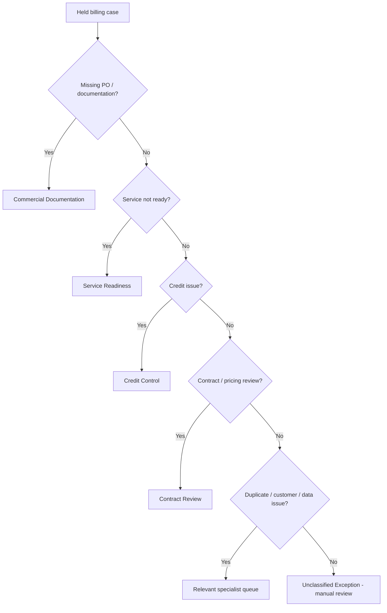

# Billing & Revenue Hold Management Platform

**Finance Transformation | Billing Controls | Revenue Operations | Decision Automation**

A synthetic portfolio solution showing how held billing orders can be converted from a manual review queue into a controlled, prioritised and auditable workflow.

The platform validates held-order data, classifies the underlying blocker, assigns accountable ownership, prioritises cases using ageing and financial exposure, recommends the next action, and quantifies illustrative capacity/ROI impact.

> **Portfolio integrity:** This project is independently recreated using fictional customers, synthetic data and generic business rules. It contains no employer code, customer information, proprietary procedures or confidential financial data.

## Executive summary

### Business problem

Billing holds are often managed through spreadsheets, email follow-up and repeated manual review. A finance team may know that an order is blocked, but not consistently know:

- why it is blocked;
- who owns resolution;
- how long it has been outstanding;
- how much billing value is exposed;
- what the next action should be; or
- which cases require immediate escalation.

This creates delayed invoicing, weak accountability, ageing backlogs, avoidable rework and poor management visibility.

### Solution concept

I designed a decision-support workflow that converts raw held-order records into a structured operational action queue.

The solution:

1. validates source data before processing;
2. classifies each hold into a standard reason category;
3. assigns an accountable owner team;
4. calculates ageing and financial exposure;
5. applies a transparent priority model;
6. recommends the next operational action;
7. preserves an explanation for every decision; and
8. produces an illustrative benefits model for capacity and ROI.

The automation supports triage and workflow. It does **not** autonomously release billing holds, recognise revenue, change customer contracts or make accounting decisions.

## Demonstration results

The included synthetic dataset contains **12 held orders with £423.3k of illustrative billing value**.

| Priority | Cases | Interpretation |
|---|---:|---|
| Critical | 4 | Very aged and/or high-value cases requiring immediate review |
| High | 6 | Material ageing or value requiring prioritised action |
| Medium | 1 | Standard managed exception |
| Low | 1 | Lower-risk case within normal review tolerance |

The engine routes the sample population across commercial documentation, service readiness, credit control, contract review, duplicate validation, customer dependency, data quality and manual-review exceptions.

## End-to-end operating model

```mermaid
flowchart LR
    A[CRM / ERP / Billing hold data] --> B[Validation & control checks]
    B --> C[Hold classification]
    C --> D[Ownership routing]
    D --> E[Ageing + value prioritisation]
    E --> F[Recommended action]
    F --> G[Exception / action queue]
    G --> H[Human review & resolution]
    H --> I[Billing release / correction]
    I --> J[Management reporting & audit trail]
```



## Decision hierarchy



The hierarchy is intentionally deterministic and explainable. If the engine cannot classify a case reliably, it routes it to manual review rather than inventing a decision.

## Example

A fictional order for **Clearview Housing** has been on hold for 181 days with £88k of illustrative billing value. The source reason indicates a data-quality issue.

The engine produces:

- **Category:** Data Quality
- **Owner:** Revenue Operations
- **Priority:** Critical
- **Recommended action:** Correct source data and revalidate
- **Decision reason:** `Data Quality; 181 days on hold; value 88,000`

This makes the recommendation transparent to Finance, Operations and audit reviewers.

## Key capabilities demonstrated

- Billing-hold classification
- Revenue-exposure prioritisation
- Ageing analysis
- Owner-team assignment
- Exception-based workflow design
- Recommended-next-action logic
- Data-quality controls
- Auditable reason codes
- Management prioritisation
- Capacity and ROI modelling

## Controls and governance

Automation in Finance requires explicit controls. This prototype demonstrates:

- mandatory-field validation;
- deterministic rule precedence;
- an explicit unclassified-exception route;
- human review before operational release;
- separation of workflow prioritisation from accounting judgement;
- traceable recommendation reasons; and
- testable rule behaviour.

See [Business Rules](docs/business_rules.md), [Controls & Governance](docs/controls_and_governance.md) and [Solution Design](docs/solution_design.md).

## Enterprise implementation view

A production version could integrate with:

- **CRM / commercial data:** Salesforce or equivalent;
- **ERP / billing:** NetSuite or another finance platform;
- **service data:** delivery or fulfilment systems;
- **workflow:** case management, ServiceNow or approval queues;
- **analytics:** billing-risk dashboards, ageing trends and owner performance; and
- **AI assistance:** exception summarisation, root-cause clustering and reviewer guidance, while retaining human approval for financial decisions.

See the [Enterprise Implementation Blueprint](docs/enterprise_implementation_blueprint.md).

## Illustrative automation value

The repository includes a transparent ROI calculator. Using the current synthetic assumptions, it estimates:

- **1,104 annual hours released**;
- **0.61 FTE equivalent capacity**;
- **£24,288 annual gross benefit**;
- **£18,288 annual net benefit** after support cost; and
- **approximately 11.8 months payback**.

These are **illustrative portfolio assumptions, not measured employer results**. The assumptions are deliberately visible in `data/roi_assumptions.csv` so the business case can be challenged and replaced with validated data.

## Repository structure

```text
billing-and-revenue-hold-management-platform/
├── README.md
├── data/
│   ├── sample_billing_holds.csv
│   └── roi_assumptions.csv
├── src/
│   ├── hold_management_engine.py
│   └── roi_calculator.py
├── outputs/
│   ├── example_hold_recommendations.csv
│   └── example_roi_summary.csv
├── docs/
│   ├── business_rules.md
│   ├── solution_design.md
│   ├── controls_and_governance.md
│   ├── enterprise_implementation_blueprint.md
│   ├── portfolio_story.md
│   └── roi_methodology.md
└── tests/
    └── test_hold_management_engine.py
```

## Technology

- Python
- pandas
- pytest
- CSV-based synthetic data
- Mermaid process and architecture diagrams
- GitHub documentation and version control

## Run locally

```bash
pip install -r requirements.txt
python src/hold_management_engine.py
python src/roi_calculator.py
pytest -q
```

## What this project demonstrates professionally

This repository is designed to demonstrate **Finance Transformation**, not pure software development.

**Business problem → process redesign → control framework → data rules → automation → exception management → human governance → benefits measurement**

It demonstrates capability across:

- finance and billing transformation;
- Order-to-Cash and revenue operations;
- process discovery and future-state design;
- business-rule and control design;
- enterprise implementation thinking;
- automation and data analysis;
- benefits realisation / ROI; and
- translation between Finance, Operations and Technology teams.

## Interview / portfolio story

A concise explanation is available in [Portfolio Story](docs/portfolio_story.md).

## Disclaimer

This is an independent portfolio project built solely with synthetic data and generic industry scenarios. It should not be represented as the exact codebase, data, operating procedure or control framework of any employer. It is not intended for accounting, revenue-recognition, legal, credit or customer decisions without appropriate professional review.