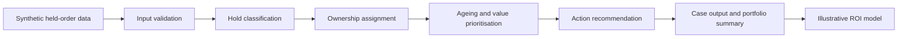

# Billing & Revenue Hold Management Platform

A synthetic portfolio project demonstrating how finance and operations teams can classify billing holds, quantify revenue exposure, assign ownership, prioritise ageing, recommend the next action, and estimate potential automation value.

> **Portfolio note:** This project is inspired by real-world finance transformation and billing-control experience. The implementation shown here has been independently recreated using fictional entities, synthetic data, and generic business rules. It contains no confidential, proprietary, or personally identifiable information.

## Industry problem

Billing and revenue holds are often managed through fragmented spreadsheets and manual follow-up. Common consequences include:

- delayed invoicing and cash collection;
- poor visibility of revenue exposure;
- inconsistent ownership;
- ageing cases with no clear action;
- repeated manual review; and
- weak auditability and management reporting.

## Proposed solution

The platform evaluates synthetic held-order records and produces:

- a standardised hold category;
- an accountable owner team;
- an action recommendation;
- ageing and revenue-risk priority;
- an explainable reason for each decision;
- a management summary of held value and case volume; and
- an editable ROI model showing potential time and cost benefits.

## Key capabilities

- Billing-hold classification
- Revenue-at-risk prioritisation
- Ageing-band analysis
- Owner-team assignment
- Recommended next action
- Exception and data-quality flags
- Auditable decision reasons
- Portfolio-level management summary
- Time-saved, FTE-capacity, ROI, and payback modelling

## Solution flow



## Illustrative automation value

The repository includes a transparent, editable ROI calculator. Using the current sample assumptions, it estimates:

- **1,104 annual hours released**;
- **0.61 FTE equivalent capacity**;
- **£24,288 annual gross benefit**;
- **£18,288 annual net benefit** after support cost;
- **approximately 11.8 months payback**; and
- **1.2% first-year ROI**, with stronger economics from year two because the one-time build cost is not repeated.

These figures are illustrative, not measured production results. Every assumption is visible in `data/roi_assumptions.csv` and can be replaced with validated business data.

## Repository structure

```text
billing-and-revenue-hold-management-platform/
├── README.md
├── data/
│   ├── sample_billing_holds.csv
│   └── roi_assumptions.csv
├── src/
│   ├── hold_management_engine.py
│   └── roi_calculator.py
├── outputs/
│   ├── example_hold_recommendations.csv
│   └── example_roi_summary.csv
├── docs/
│   ├── business_rules.md
│   ├── solution_design.md
│   ├── portfolio_story.md
│   └── roi_methodology.md
└── tests/
    └── test_hold_management_engine.py
```

## Technology

- Python
- pandas
- CSV-based synthetic data
- pytest
- GitHub

## Run locally

```bash
pip install -r requirements.txt
python src/hold_management_engine.py
python src/roi_calculator.py
pytest -q
```

## Business outcomes this type of solution can support

- Faster resolution of billing blockers
- Improved visibility of delayed revenue
- Clearer accountability across teams
- Reduced manual review and rework
- Better prioritisation of high-value and aged cases
- Stronger billing governance and auditability
- Quantified capacity release and investment payback

## Portfolio positioning

This project demonstrates the ability to translate a billing-control problem into a structured, explainable automation solution connecting finance operations, process governance, data analysis, technology delivery, and benefits realisation.

## Important interpretation

Time saved does not automatically equal cash saved. Depending on the operating model, the benefit may appear as released capacity, improved service levels, reduced rework, faster billing, avoided hiring, or earlier revenue release.

## Disclaimer

This is an independent portfolio project built with synthetic data and generic business scenarios. All ROI figures are illustrative assumptions rather than measured employer results. It is intended for learning and portfolio demonstration only and should not be used for accounting, revenue-recognition, legal, credit, investment, or customer decisions without appropriate professional review.