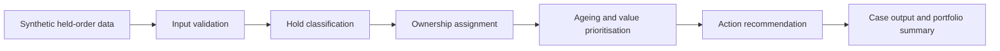

# Billing & Revenue Hold Management Platform

A synthetic portfolio project demonstrating how finance and operations teams can classify billing holds, quantify revenue exposure, assign ownership, prioritise ageing, and recommend the next action.

> **Portfolio note:** This project is inspired by real-world finance transformation and billing-control experience. The implementation shown here has been independently recreated using fictional entities, synthetic data, and generic business rules. It contains no confidential, proprietary, or personally identifiable information.

## Industry problem

Billing and revenue holds are often managed through fragmented spreadsheets and manual follow-up. Common consequences include:

- delayed invoicing and cash collection;
- poor visibility of revenue exposure;
- inconsistent ownership;
- ageing cases with no clear action;
- repeated manual review; and
- weak auditability and management reporting.

## Proposed solution

The platform evaluates synthetic held-order records and produces:

- a standardised hold category;
- an accountable owner team;
- an action recommendation;
- ageing and revenue-risk priority;
- an explainable reason for each decision; and
- a management summary of held value and case volume.

## Key capabilities

- Billing-hold classification
- Revenue-at-risk prioritisation
- Ageing-band analysis
- Owner-team assignment
- Recommended next action
- Exception and data-quality flags
- Auditable decision reasons
- Portfolio-level management summary

## Solution flow



## Repository structure

```text
billing-and-revenue-hold-management-platform/
├── README.md
├── data/
│   └── sample_billing_holds.csv
├── src/
│   └── hold_management_engine.py
├── outputs/
│   └── example_hold_recommendations.csv
├── docs/
│   ├── business_rules.md
│   ├── solution_design.md
│   └── portfolio_story.md
└── tests/
    └── test_hold_management_engine.py
```

## Technology

- Python
- pandas
- CSV-based synthetic data
- pytest
- GitHub

## Run locally

```bash
pip install -r requirements.txt
python src/hold_management_engine.py
pytest -q
```

## Business outcomes this type of solution can support

- Faster resolution of billing blockers
- Improved visibility of delayed revenue
- Clearer accountability across teams
- Reduced manual review effort
- Better prioritisation of high-value and aged cases
- Stronger billing governance and auditability

## Portfolio positioning

This project demonstrates the ability to translate a billing-control problem into a structured, explainable automation solution connecting finance operations, process governance, data analysis, and technology delivery.

## Disclaimer

This is an independent portfolio project built with synthetic data and generic business scenarios. It is intended for learning and portfolio demonstration only and should not be used for accounting, revenue-recognition, legal, credit, or customer decisions without appropriate professional review.