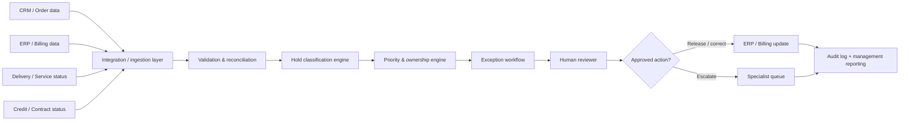

# Enterprise Implementation Blueprint

## Objective

Translate the synthetic billing-hold prototype into a production-ready finance-transformation operating model while preserving control, auditability and human accountability.

## Target-state architecture

## Data inputs

A production solution could combine:

- customer and order identifiers;
- order / invoice value;
- hold reason and hold date;
- purchase-order status;
- service / fulfilment readiness;
- credit status;
- contract / pricing status;
- customer response status;
- last-action date; and
- owner / workflow status.

Every field should have a defined system of record, refresh cadence and data-quality control.

## Processing layers

### 1. Data ingestion and reconciliation

- Collect the current hold population from approved source systems.
- Reconcile record counts and financial value to the source extract.
- Reject or quarantine records with missing mandatory identifiers.
- Log source timestamp and processing run ID.

### 2. Classification

Apply approved and version-controlled rules to identify the primary blocker. Rule precedence must be explicit so the same record produces the same result when the same data is supplied.

### 3. Ownership and priority

Map each category to an accountable queue and calculate urgency using approved criteria such as:

- ageing;
- financial exposure;
- customer dependency;
- billing-cycle cut-off;
- contractual deadline; and
- known control risk.

### 4. Human review

The system should support decision-making rather than bypass financial governance. Human approval remains appropriate for actions such as:

- releasing a billing hold;
- cancelling an order;
- changing pricing or contract terms;
- overriding credit controls;
- revenue-recognition decisions; and
- material data corrections.

### 5. Workflow and audit

Each case should preserve:

- original source values;
- classification and rule version;
- assigned owner;
- recommended action;
- reviewer decision;
- override reason where applicable;
- timestamps; and
- final resolution.

## Management reporting

A production dashboard could show:

- total held billing value;
- number of held orders;
- ageing distribution;
- value and volume by hold category;
- value and volume by owner team;
- Critical / High-priority backlog;
- average resolution time;
- first-time classification rate;
- unclassified-exception rate;
- reopened / rework rate;
- released billing value; and
- capacity released through automation.

## AI opportunities

AI can add value around the deterministic control layer rather than replacing it. Potential uses include:

- summarising complex case history;
- clustering free-text hold reasons;
- identifying recurring root causes;
- drafting reviewer notes;
- recommending knowledge articles; and
- explaining why a case appears anomalous.

High-impact actions should remain governed by deterministic rules and/or human approval.

## Implementation phases

### Phase 1 — Discover
Map the current process, systems, stakeholders, control points, volumes, effort and root causes.

### Phase 2 — Design
Define the target taxonomy, ownership model, business rules, exception paths, controls and KPIs.

### Phase 3 — Prototype
Test the logic on representative non-production data and reconcile outputs to expected results.

### Phase 4 — UAT and controls validation
Run business-led scenarios including normal cases, conflicting indicators, missing data, overrides and failure conditions.

### Phase 5 — Deploy
Integrate approved data sources and workflow tooling, establish access controls and operational support.

### Phase 6 — Measure and improve
Track adoption, resolution time, ageing, unclassified cases, rework, released capacity and financial impact. Use root-cause trends to remove recurring sources of billing holds upstream.

## Transformation principle

The long-term goal is not merely to process billing holds faster. It is to create a feedback loop that identifies why holds occur, fixes upstream process defects and progressively reduces the number of exceptions entering the process.