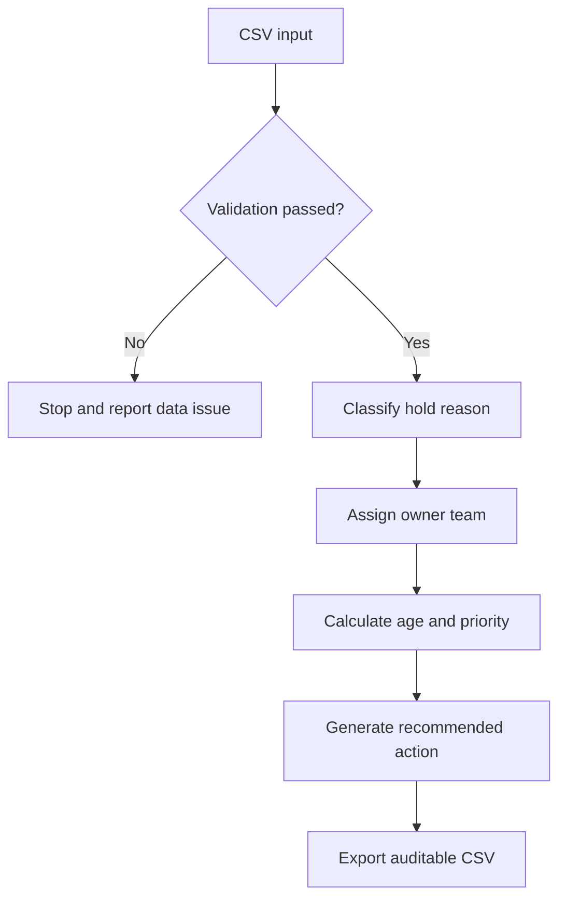

# Solution Design

## Objective

Provide a transparent prototype that converts raw billing-hold records into consistent operational recommendations and management insight.

## Components

1. **Synthetic source data** — fictional held-order records.
2. **Validation layer** — confirms required fields and valid numeric/date values.
3. **Classification engine** — assigns a standard hold category.
4. **Ownership engine** — routes each case to a generic accountable team.
5. **Priority engine** — combines ageing and held value.
6. **Recommendation output** — records the action and decision reason.

## Processing architecture

## Design principles

- Explainable rules rather than opaque scoring
- Human review for exceptions
- Synthetic and privacy-safe data
- Separation between operational prioritisation and accounting judgement
- Reusable structure suitable for future dashboards or workflow integration

## Limitations

This prototype does not post transactions, release holds, recognise revenue, contact customers, or connect to production systems. Dates and thresholds are illustrative.